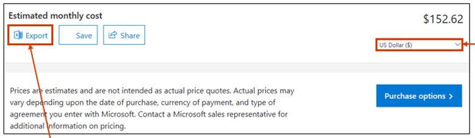
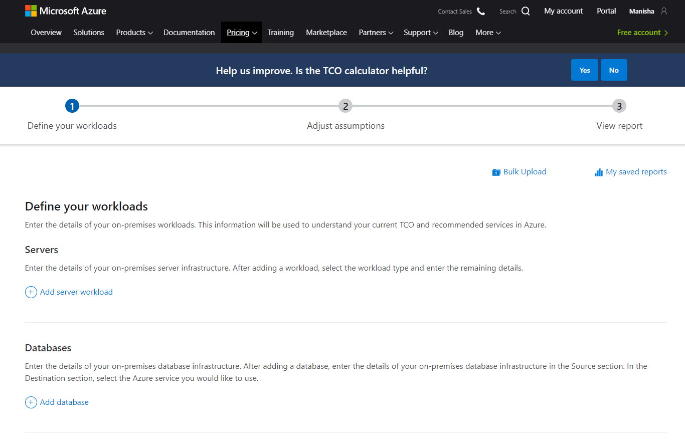
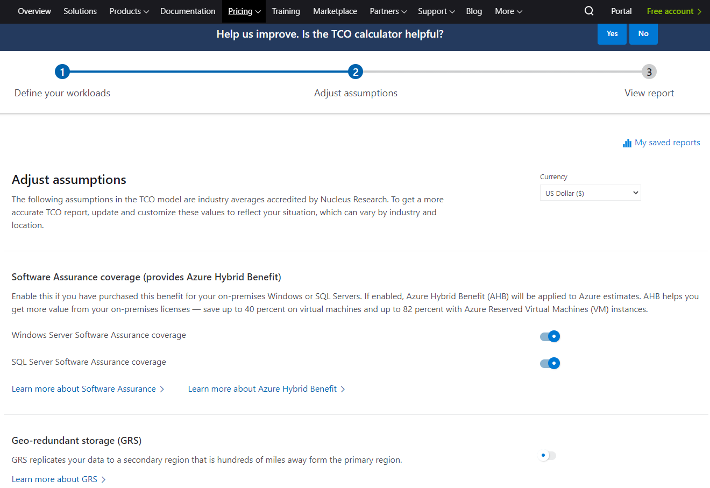
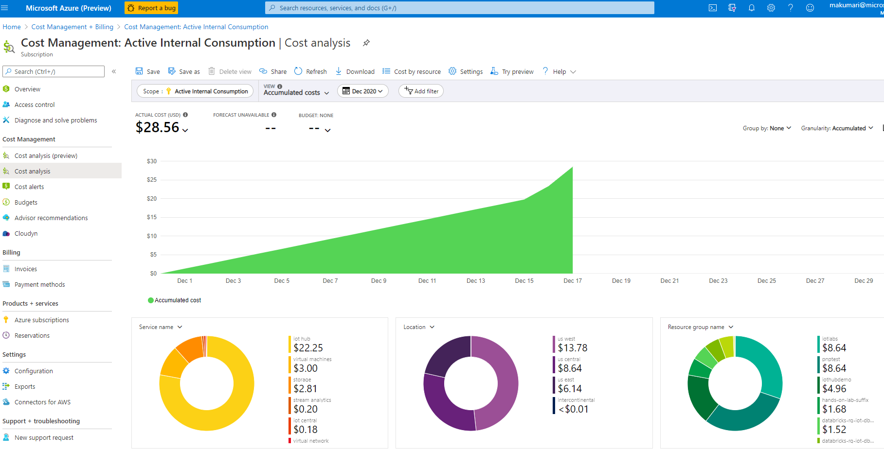
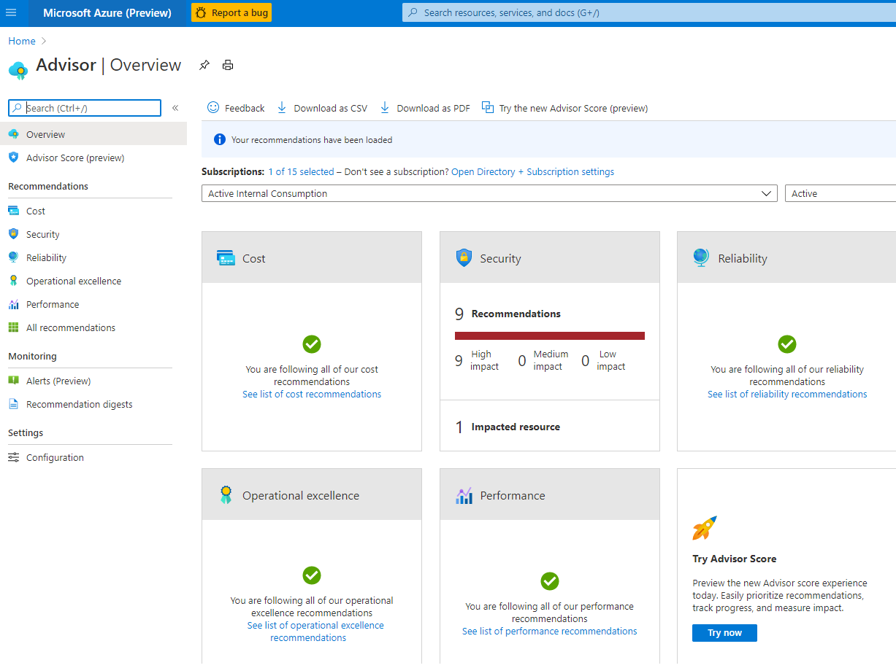
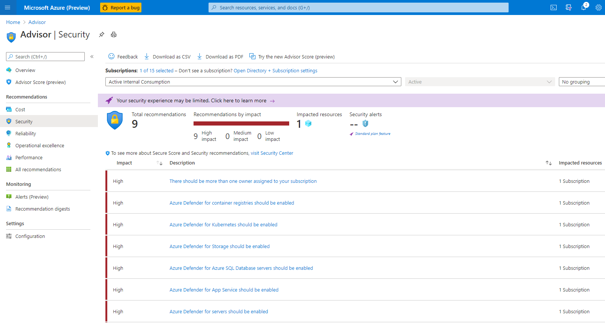

# Pricing your architecture

Understanding, monitoring and optimizing your costs on Azure can get complex fast, as you grow to use more managed services, more virtual machines, and start provisioning resources automatically or in a self-service model. Azure Cost Calculator is a free cost management tool that can help you estimate your cloud costs for new Azure deployments, or variations of your existing workloads.

In this article, you will learn:
- What is Azure Pricing Calculator
- Azure Cost Calculator features
- Using the calculator to price the below architecture 

## What is Azure Pricing Calculator

Azure Pricing Calculator is a tool you can use to gain real-time cost estimates for your services. You can customize these estimates with personal configurations for greater accuracy, and can access and modify the estimates through a central dashboard.You can use the calculator, in combination with other resources such as the Azure TCO Calculator, to perform Azure cost optimization.

## Azure Cost Calculator Features

The Azure Cost Calculator provides several capabilities, including:

- See all Azure products and services, with a short description and a link to a product page. Each page has detailed specs and cost estimates.
- Customize services you wish to include per your storage requirements, resource consumption, performance expectations, and budget. As you read about and select services, the calculator caches your selections to ensure that progress is not lost.
- As you select services, you can swap back and forth between product screens and cost estimates. Each service you’ve selected is displayed with a cost breakdown on the estimates page. You can also return to product pages from the estimates screen in case you want to re-evaluate your options.
- If you find that you no longer want a service or want to edit your parameters, you can do so from the Estimate screen.
- Once you’re satisfied with your estimate, you can click Purchase options. You can then either purchase resources directly through the Azure site, via your Microsoft representative, or via a managed service partner.

## How to Use Azure Cost Calculator

Using the Azure Cost Calculator is very straightforward. Below is a brief outline you can use to access and operate the calculator.
1. From the Azure <a href="https://azure.microsoft.com/en-us/pricing/">Pricing</a> page, click on Pricing calculator.

    

2. Search for the products you want or select from the featured products below the search bar. You can also click the Example Scenarios tab if you’d rather modify a template set-up.

    

3. In the search boox, type IoT Hub and click on it to add it to your price estimate. Change the parameters of the IoT Hub created to best suit your needs. In this case, select IoT Hub tier as **Standard**, select region as **East US** and Edition as **S1**
 

1. Repeat step 3 for **Virtual Machines**, **Stream Analytics**, **Databricks**, **Blob Storage** and **Power BI**
1. Once you’ve added your services, you can see the estimate and provide product specifications in the Saved Estimates tab. 

1. As you add products, you can modify the configuration of each product in your estimate to optimize your costs. You can also see how resources overlap, for example if two Azure services use the same underlying storage or compute services.
1. After you finish, you have the option to Export to Excel, Save, or Share your estimate report. Saved reports remain in the Saved Estimates tab. 

 

# Monitor costs

So, now you have created your cost model and bought resources to implement your architecture. The next question is how do you monitor these costs and make sure you don't exceed your budget while getting optimal performance from all your resources.

### Generate cost reports

To monitor the cost of the workload, use Azure cost tools or custom reports. The reports can be scoped to business units, applications, IT infrastructure shared services, and so on. Make sure that the information is consistently shared with the stakeholders.

Azure provides cost tools that can help track cloud spend and make recommendations.

- <a href="https://azure.microsoft.com/en-us/pricing/tco/#:~:text=The%20TCO%20Calculator%20lets%20you,save%20by%20moving%20to%20Azure.">Azure TCO Calculator</a>
- <a href="https://docs.microsoft.com/en-us/azure/cost-management-billing/costs/quick-acm-cost-analysis?tabs=azure-portal"> Cost Analysis
- <a href="https://docs.microsoft.com/en-us/azure/advisor/advisor-cost-recommendations">Azure Advisor</a>

## Exercise 1: Azure TCO Calculator

When evaluating your usage of the Azure cloud, it’s important to consider the total cost of ownership (TCO). TCO is key to understanding the real cost of your projects and measuring your return on investment (ROI). Azure offers a TCO calculator, one of a set of Azure cost management tools, that lets you estimate the cost of migrating your server workloads to Azure and predict your potential savings for existing workloads.

#### What is Total Cost of Ownership (TCO)?
TCO is the cost of a product or service plus any operating costs. You can use TCO to weigh risk against reward when acquiring services, hardware, or applications. TCO calculations are key to strategic procurement and ensuring the greatest possible return on investment (ROI).To calculate TCO, you need to use a variety of tools and processes which can help you assign dollar amounts to intangibles. When calculating TCO for on-premise purchases, you should take into account facility and labor costs. For public clouds, it can be easier to estimate TCO because all aspects of the computing services are provided and priced by the cloud provider. This is where the Azure TCO Calculator comes in.

#### Azure TCO Calculator: What Is it Used For?

For users wishing to adopt cloud services, Azure provides a web-based TCO Calculator. You can use this calculator to estimate the costs of migrating your data and applications to Azure and predict potential savings.

#### How to use TCO Calculator

Step 1: Navigate to https://azure.microsoft.com/en-us/pricing/tco/calculator/

Step 2: Add all your on-premise workloads here and adjust assumptions in the next step
 

Step 3: And your savings report is ready to view. Just 3 simple steps to calculate TCO. You can use the TCO calculator to measure ROI yourself or to make a convincing case to move to cloud from on-premises to your colleagues and leadership

## Exercise 2: Cost analysis
Cost analysis is a tool in Azure Cost Management that allows you to view aggregated costs over a period. This view can help you understand your spending trends.

View costs at different scopes, such as for a resource group or specific resource tags. Cost Analysis provides built-in charts and custom views. You can also download the cost data in CSV format to analyze with other tools.

Step 1: Sign in to the Azure portal at https://portal.azure.com
-  Review costs in cost analysis
To review your costs in cost analysis, go to cost management+ billing 

 

Step 2: Open the scope in the Azure portal and select Cost analysis in the menu.

 

Step 3: Click on Cost Management on the left side pane and then click on Cost Analysis

 

Here, you can see your costs broken down by date, month, location and resource group so you have a variety of views to meet your needs.

Step 4: To further leverage this, click on View and change it to cost by resource, daily costs etc. 

## Exercise 3: Azure Advisor

#### What is Azure Advisor

Advisor is a personalized cloud consultant that helps you follow best practices to optimize your Azure deployments. It analyzes your resource configuration and usage telemetry and then recommends solutions that can help you improve the cost effectiveness, performance, Reliability (formerly called High availability), and security of your Azure resources.

#### How to use Azure Advisor

Step 1: To access your Azure Advisor, sign into Azure portal at https://portal.azure.com
- Type Advisor in the Search bar and select Advisor from the drop-down menu. You will get a view of recommendations for cost optimizing, security, reliability, operational excellence, performance etc.

 

Step 2: Since, I have 9 recommendations in Security, I will click on it and see the recommendations

I can look at these recommendations and make changes if I wish. I can also download it as PDF or CSV file and save it for later use or share it with any co-owners of the account. 

