# Azure IoT Academy: Windows IoT Lab

In this lab we will be setting up Azure IoT Edge for Linux on Windows (EFLOW) with a Live Video Analytics module to showcase how to Windows IoT OS enables various retail and safety scenarios.  

## **Content:** ##

- [Exercise 1: Set up Environment](#exercise-1-set-up-environment)
   - [Task 1: Virtual Network](#task-1-virtual-network)
   - [Task 2: Virtual Machine](#task-2-virtual-machine)
   - [Task 3: Connect to Virtual Machine](#task-3-connect-to-virtual-machine)
- [Exercise 2: Set up Azure Edge For Linux on Windows](#exercise-2-set-up-azure-edge-for-linux-on-windows)
   - [Task 1: Enable Hyper-V](#task-1-enable-hyper-v)
   - [Task 2: Set up Azure IoT Hub](#task-2-set-up-azure-iot-hub)
   - [Task 3: Register an IoT Hub Device](#task-3-register-an-iot-hub-device)
   - [Task 4: Download Windows Admin Center](#task-4-download-windows-admin-center)
   - [Task 5: Create a new deployment](#task-5-create-a-new-deployment)
   - [Task 6: Verify successful configuration](#task-6-verify-successful-configuration)
- [Exercise 3: Set up Live Video Analytics](#exercise-3-set-up-live-video-analytics)
  - [Task 1: Download Tools and Resources](#task-1-download-tools-and-resources)
  - [Task 2: Create Azure Resources](#task-2-create-azure-resources)
  - [Task 3: Configure the Azure IoT Tools extension](#task-3-configure-the-azure-iot-tools-extension)
  - [Task 4: Deploy Modules on Windows Host](#task-4-deploy-modules-on-windows-host)
  - [Task 5: Provision Azure IoT Edge for Linux Configuration](task-5-provision-azure-iot-edge-for-linux-configuration)
  - [Task 6: Test Video Stream](task-6-test-video-stream)
  - [Task 7: Enable Live Video Analytics: Inferencing](task-7-enable-live-video-analytics-inferencing)
  - [Task 8: Connect Windows Video with Linux Inferencing](task-8-connect-windows-video-with-linux-inferencing)
- [Exercise 4: Clean up](#exercise-7-clean-up)
   - [Task 1: Delete resources](#task-1-Delete-resources)

## **Exercise 1: Set up Environment** ##
During this exercise you will be setting up your Windows 10 IoT Enterprise environment for this lab in an Azure Virtual Machine.

### **Task 1: Virtual Network** ###

1. In your browser, navigate to the [Azure portal](https://portal.azure.com), select **+Create a resource** in the navigation pane, enter `virtual Network` into the **Search the Marketplace** box.

2. Select **Virtual Network** from the results, and then select **Create**.

   <kbd></kbd>

3. In **Create virtual network**, enter or select this information in the **Basics** tab:

      | Setting | Value |
      | ------- | ----- |
      | **Project details** |   |
      | Subscription | Select your subscription. |
      | Resource group | Select **Create new**.  </br> **Enter a name** for the Resource Group. </br> Select **OK**. |
      | **Instance details** |   |
      | Name | Enter **myVNetwork**. |
      | Region | Select **(US) East US**. |

   <kbd></kbd>

4. Select the **IP Addresses** tab, or select the **Next: IP Addresses** button at the bottom of the page.

5. In **IPv4 address space**, select the existing address space and change it to **10.1.0.0/16**.

6. Select **+ Add subnet**, then enter **MySubnet** for **Subnet name** and **10.1.0.0/24** for **Subnet address range**.

7. Select **Add**.

    <kbd></kbd>

  >[!NOTE] You can ignore the warning as we are not intending to peer virtual networks.

8. Select the **Security** tab, or select the **Next: Security** button at the bottom of the page.

9. Under **BastionHost**, select **Enable**. Enter this information:

    | Setting            | Value                      |
    |--------------------|----------------------------|
    | Bastion name | Enter **myBastionHost** |
    | AzureBastionSubnet address space | Enter **10.1.1.0/24** |
    | Public IP Address | Select **Create new**. </br> For **Name**, enter **myBastionIP**. </br> Select **OK**. |

10. Select the **Review + create** tab or select the **Review + create** button.

    <kbd></kbd>

11. Select **Create**.

    <kbd></kbd>

12. It will take a few minutes to deploy. At the end you should see the your resources deployed.

    <kbd></kbd>


### **Task 2: Virtual Machine** ###

1. On the upper-left side of the portal, select: **Create a resource** > **Compute** > **Virtual machine** >> **Create**

    <kbd></kbd>

2. In **Create a virtual machine**, type or select the values in the **Basics** tab:

    | Setting | Value                                          |
    |-----------------------|----------------------------------|
    | **Project Details** |  |
    | Subscription | Select your Azure subscription |
    | Resource Group | Select Your Resource Group |
    | **Instance details** |  |
    | Virtual machine name | Enter **myVM1** |
    | Region | Select **(US) East US** |
    | Availability Options | Select **No infrastructure redundancy required** |
    | Image | Select **Windows 10 Pro, Vnext - Gen1** |
    | Azure Spot instance | Select **No** |
    | Size | **Standard_D4s_v3 - 4 vcpus, 16 GiB memory** |
    | **Administrator Account** | **Use the following Credentials** |
    | Username | **AIOTA** |
    | Password | **Password123!** |
    | Confirm password | **Password123!** |
    | **Inbound port rules** |    |
    | Public inbound ports | Select **None**. |

    <kbd></kbd>

3. Select the **Networking** tab, or select **Next: Disks**, then **Next: Networking**.

4. In the Networking tab, select or enter:

    | Setting | Value |
    |-|-|
    | **Network interface** |  |
    | Virtual network | Select **myVNetwork**. |
    | Subnet | Select **mySubnet** |
    | Public IP | Select **None** |
    | NIC network security group | Select **Basic**|
    | Public inbound ports network | Select **None**. |

    <kbd></kbd>

5. Select the **Review + create** tab, or select the blue **Review + create** button at the bottom of the page.

6. Review the settings, and then select **Create**.

    <kbd></kbd>

7. It will take a few minutes to deploy. At the end you should see the your resources deployed.

    <kbd></kbd>

### **Task 3: Connect to Virtual Machine** ###

1. Navigate to the Azure Portal Home and select your newly created virtual machine.

2. Make sure you that you start your Virtual Machine and that the status is **Running**.

    <kbd></kbd>


>[!TIP]
> You will not be able to start the Bastion connection if the VM has not been started and is running. So give it a minute or two to finish updating and wait for the status to say "Running".

3. In the VM menu bar, select **Connect**, then select **Bastion**.

    <kbd></kbd>

4. In the **Connect** page, select the blue **Use Bastion** button.

    <kbd></kbd>

5. In the **Bastion** page, enter the username and password for the virtual machine.

    | Field | Enter |
    |-------|-------|
    | **Username** | *AIOTA* |
    | **Password** | *Password123!* |

6. Select **Connect**.

    <kbd></kbd>

7. A new tab should open, and you should be connected to your virtual machine.

8. **Accept** the default settings.

    <kbd></kbd>

9. **We will be using this virtual machine for the remaining two exercises.**


## **Exercise 2: Set up Azure Edge For Linux on Windows** ##

### **Task 1: Enable Hyper-V** ###
We are going to enable Hyper-V via PowerShell in the newly created VM.

1. Search for **PowerShell** and right click to select **Run as Administrator**.

    <kbd></kbd>

2. Run the following command:

  ```powershell
  Enable-WindowsOptionalFeature -Online -FeatureName Microsoft-Hyper-V -All
  ```

  If the command couldn't be found, make sure you're running PowerShell as an **Administrator**.

3. When the installation has completed, reboot the VM by typing in **Y**.

    <kbd></kbd>

4. Reconnect to the VM.

>[!NOTE]
> If you are not promoted to restart the VM within PowerShell. Please close the Bastion Host tab, and return to the Azure Portal, and select your VM. At this point you can either "restart your VM" and reconnect via Bastion. OR you can *STOP* the VM and *Start* the VM again.

### **Task 2: Set up Azure IoT Hub** ###

*These steps can be done outside of the VM or you can open up a browser window in the Azure Window and do everything from within the VM.*

1. Navigate to the Azure Portal, select the **+ Create a resource** button, and then enter *IoT Hub* in the **Search the Marketplace** field.

2. Select **IoT Hub** from the search results, and then select **Create**.
    <kbd>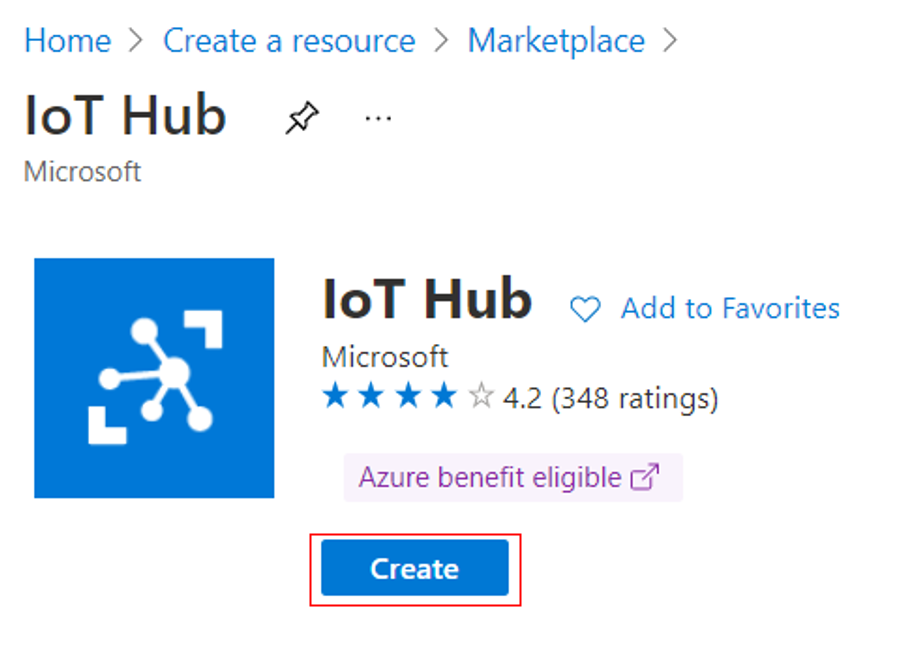</kbd>

3. On the **Basics** tab, complete the fields as follows:

   - **Subscription**: Select the subscription to use for your hub.

   - **Resource Group**: Select the resource group you've created for exercise 1 above.

   - **Region**: Select the region in which you want your hub to be located. Select the location closest to you.

   - **IoT Hub Name**: Enter a name for your hub. This name must be globally unique.

   >[!IMPORTANT]
   >
   > Because the IoT hub will be publicly discoverable as a DNS endpoint, be sure to avoid entering any sensitive or personally identifiable information when you name it.

   <kbd>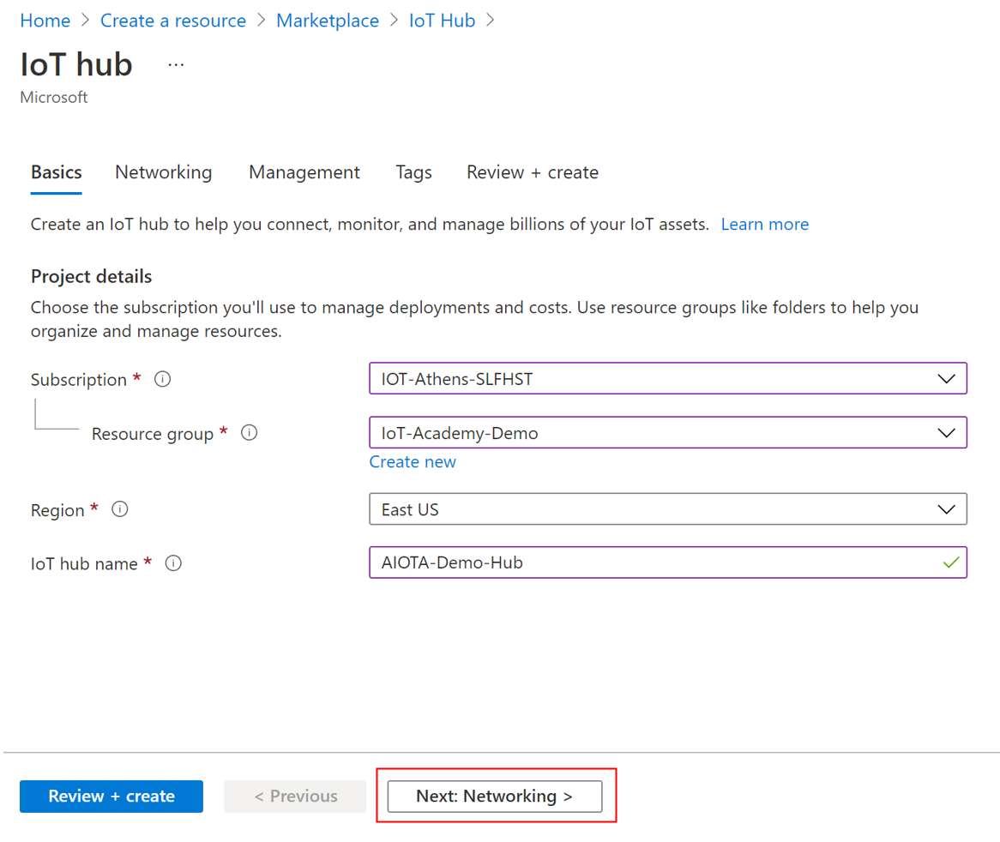</kbd>


4. Select **Next: Networking** to continue creating your hub.

   Choose the endpoints that can connect to your IoT Hub. You can select the default setting **Public endpoint (all networks)**.

   <kbd>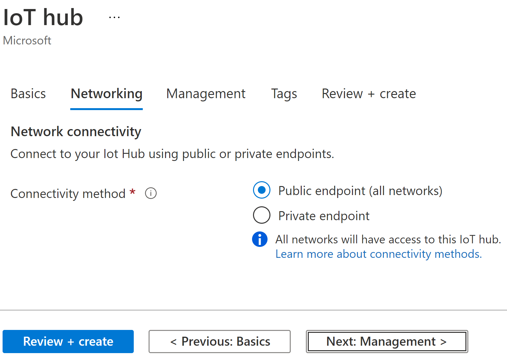</kbd>

5. Select **Next: Management** to continue creating your hub.

    You can accept the default settings here.

6. Select **Next: Tags** to continue to the next screen.

7. Select **Next: Review + create** to review your choices. You see something similar to this screen, but with the values you selected when creating the hub.

8. Select **Create** to create your new hub.

    <kbd>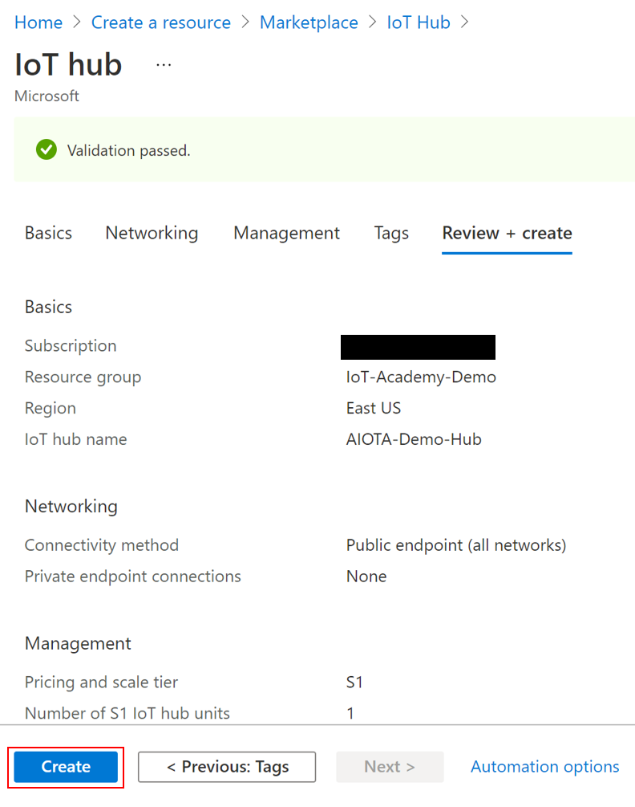</kbd>

9. It will take a few minutes for your Hub to deploy.

    <kbd></kbd>

### **Task 3: Register an IoT Hub Device** ###

1. Navigate to your IoT Hub and select **IoT Edge** from the menu.

    <kbd></kbd>

2. Select **Add an IoT Edge device**.

    <kbd>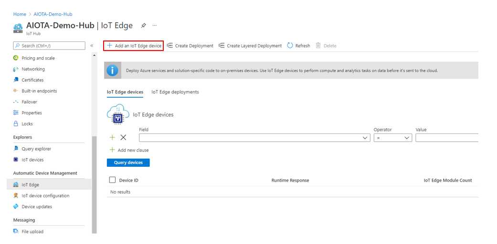</kbd>

3. Create a Device - Select or Enter:

  | Setting | Value |
  |-|-|
  | Device ID | Provide a descriptive Device ID |
  | Authentication type | **Symmetric Key** |
  | Auto-generate keys | Default - Keep Box Checked |
  | Connect this device to an IoT Hub | Select **Enable**|

4. Select **Save**.

    <kbd>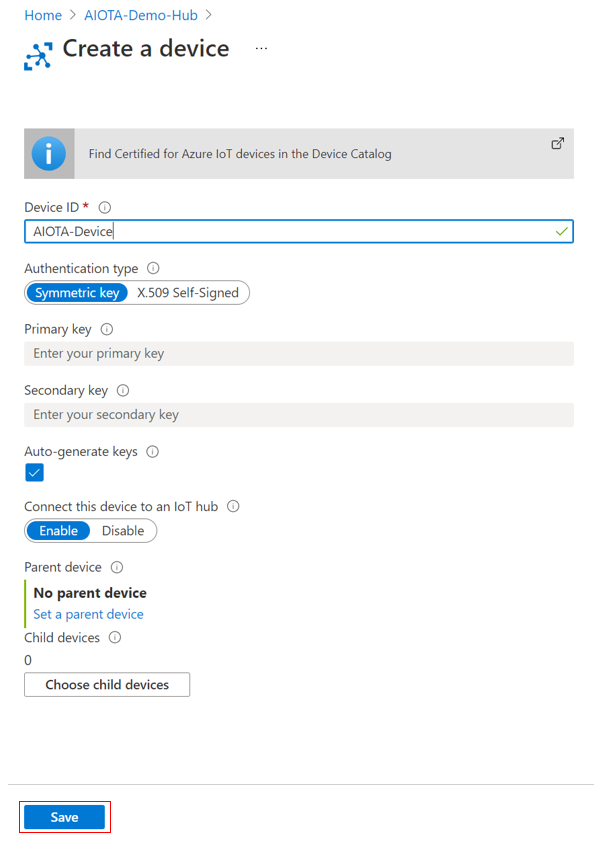</kbd>

### **Task 4: Download Windows Admin Center** ###
Back to the Windows VM, we need to download Windows Admin Center.

1. To download Windows Admin Center installer, type the following address in the browser: aka.ms/wacdownload

2. A prompt at the bottom of the screen should appear. Select **Run**

    <kbd></kbd>

3. Run the downloaded installer and follow the install wizard prompts to install Windows Admin Center.

4. Once installed, use a supported browser to open Windows Admin Center. Supported browsers include Microsoft Edge (Windows 10, version 1709 or later), Google Chrome, and Microsoft Edge Insider. Search **Windows Admin Center**

    <kbd></kbd>

5. On the first use of Windows Admin Center, you will be prompted to select a certificate to use. Select **Windows Admin Center Client** as your certificate.

6. It is time to install the Azure IoT Edge extension. Select the gear icon in the top right of the Windows Admin Center dashboard.

    <kbd></kbd>

7. On the **Settings** menu, under **Gateway**, select **Extensions**.

8. On the **Available extensions** tab, find **Azure IoT Edge** in the list of extensions. Choose it, and select the **Install** prompt above the list of extensions.

    <kbd>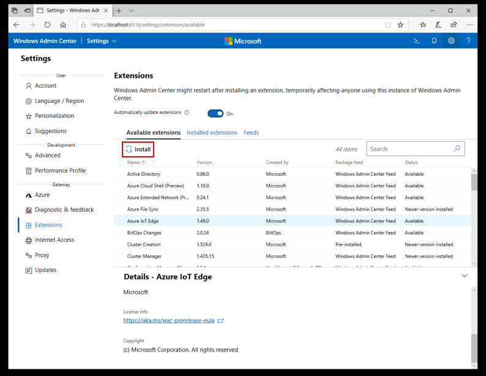</kbd>

9. After the installation completes, you should see Azure IoT Edge in the list of installed extensions on the **Installed extensions** tab.

    <kbd>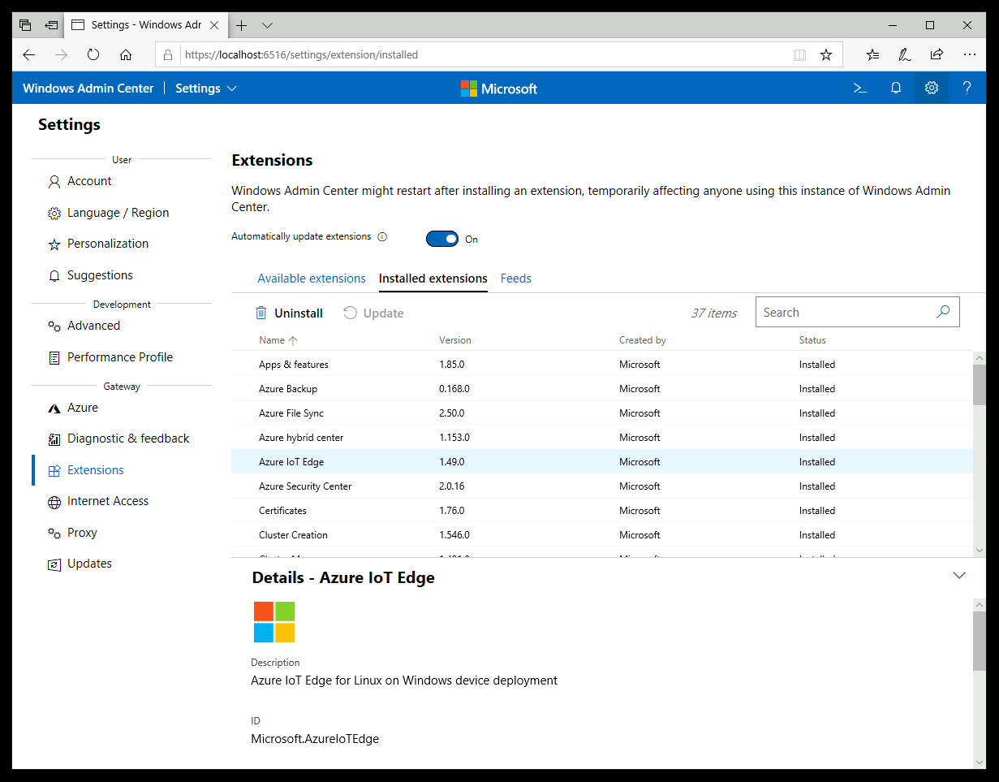</kbd>

### **Task 5: Create a new deployment** ###

On the Windows Admin Center start page, under the list of connections, you will see a local host connection representing the PC where you running Windows Admin Center. Any additional servers, PCs, or clusters that you manage will also show up here.

You can use Windows Admin Center to make install and manage Azure IoT Edge for Linux on Windows on either your local device or remote managed devices. In this guide, the local host connection will serve as the target device for the deployment of Azure IoT Edge for Linux on Windows.

1. Select **Add**.

    <kbd>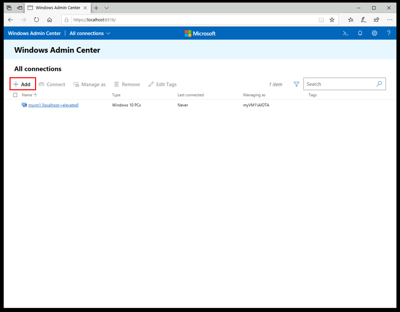</kbd>

2. On the **Add or create resources** pane, locate the **Azure IoT Edge** tile. Select **Create new** to install a new instance of Azure IoT Edge for Linux on Windows on a device.

    <kbd>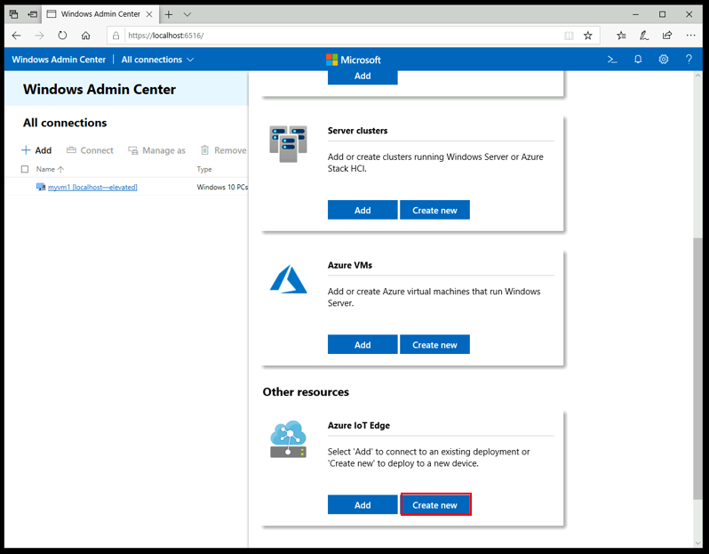</kbd>

3. The **Create an Azure IoT Edge for Linux on Windows deployment** pane will open. On the **1. Getting Started** tab, verify that your target device meets the minimum requirements, and select **Next**.

    <kbd></kbd>

4. Review the license terms, check **I Accept**, and select **Next**.

5. You can toggle **Optional diagnostic data** on or off, depending on your preference.

6. Select **Next: Deploy**.

7. On the **2.1 Deploy** tab, under **Select a target device**, click on your listed device to validate it meets the minimum requirements. Once its status is confirmed as supported, select **Next**.

    <kbd>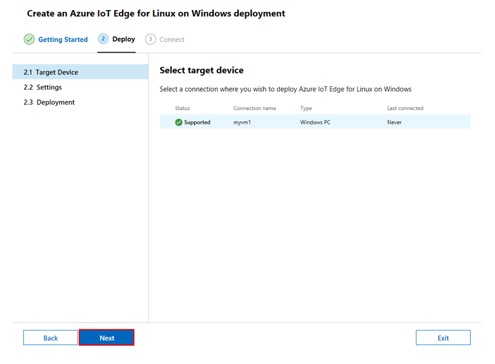</kbd>

8. On the **2.2 Settings** tab, change the **Memory and cores** configuration to **4 GB, 2 cores (Standard_A2_v2)** and select **Next**.

    <kbd>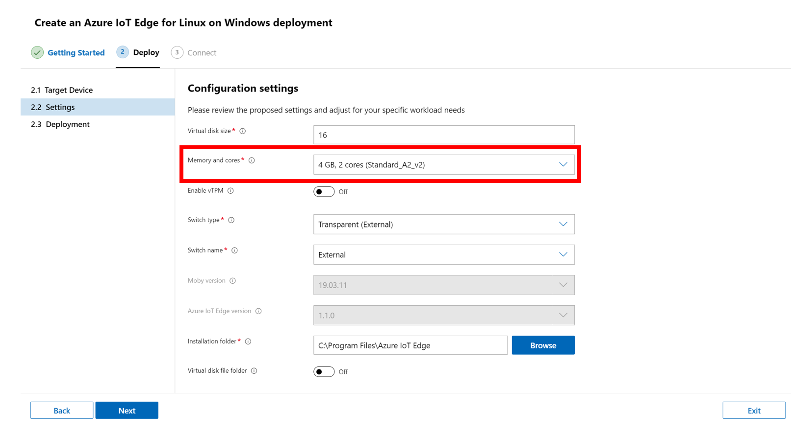</kbd>

9. On the **2.3 Deployment** tab, you can watch the progress of the deployment. The full process includes downloading the Azure IoT Edge for Linux on Windows package, installing the package, configuring the host device, and setting up the Linux virtual machine. This process may take several minutes to complete. A successful deployment is pictured below.

    <kbd></kbd>

10. Select **Next: Connect**

11. Go back to the Azure Portal in another browser tab (outside of the VM) and navigate to the **IoT Edge tab** of your **IoT Hub**.

    <kbd></kbd>

12. Click on the device ID of your device. Copy the Primary Connection String field.

    <kbd></kbd>

13. Paste it into the device connection string field in the Windows Admin Center. Then, choose Provisioning with the selected method.

    <kbd></kbd>

14. Select **Finish** once Azure IoT device has successfully provisioned.

### **Task 6: Verify successful configuration** ###

1. Select your IoT Edge device from the list of connected devices in Windows Admin Center to connect to it.

    <kbd>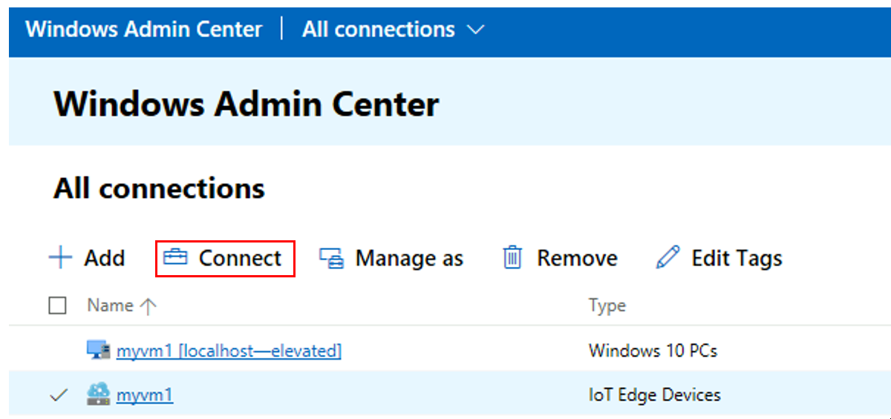</kbd>

2. The device overview page displays some information about the device:

  * The **IoT Edge Module List** section shows running modules on the device. When the IoT Edge service starts for the first time, you should only see the **edgeAgent** module running. The edgeAgent module runs by default and helps to install and start any additional modules that you deploy to your device.

  * The **IoT Edge Status** section shows the service status, and should be reporting **active (running)**.

3. If you need to troubleshoot the IoT Edge service, use the **Command Shell** tool on the device page to ssh (secure shell) into the virtual machine and run the Linux commands.

  <kbd>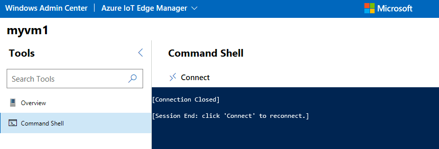</kbd>

    * If you need to troubleshoot the service, retrieve the service logs by inputting the following command:

       ```bash
       journalctl -u iotedge
       ```

    * Use the `check` tool to verify configuration and connection status of the device by using the following command:

       ```bash
       sudo iotedge check
       ```

>[!TIP]
>
> If you Azure IoT Edge VM is not running due to a break or interrupt in connection, please visit Hyper-V Manager:
> 1. Start the VM, if you are unable to start the VM, right click on the VM and clear "last saved state" and try again
> 2. Visit the networking tab at the bottom and wait until an IP address has been populated to ensure that your VM is running.


## **Exercise 3: Set up Live Video Analytics** ##

This exercise will be completed in the Azure Virtual Machine as well.

### **Task 1: Download Tools and Resources** ###

In your **Azure Virtual Machine** install the following tools:
* Visual Studio Code: https://code.visualstudio.com/Download
* .Net Core 3.1 SDK: https://dotnet.microsoft.com/download/dotnet/thank-you/runtime-desktop-3.1.14-windows-x64-installer
* Download VLC media player: https://www.videolan.org/

Unzip the following folders and **move to your Azure VM's Desktop**:
* Windows Application: https://microsoft-my.sharepoint-df.com/:u:/p/fcabrera/EUvyooP-wZxMn4L1Hzjy8K4By7bDvrsLiV6EF-LZGGsOfw?e=SXZ3MD
* Certificates: https://microsoft-my.sharepoint-df.com/:u:/p/fcabrera/EdBZVhNFfpJLro5h7hJ8pjgBLl5qaXZ7fE8gn8GwsBbtTw?e=GEns2F

### **Task 2: Create Azure Resources** ###
1. Go to [Azure portal](https://portal.azure.com) and select the Cloud Shell icon.


    

2. If you're using Cloud Shell for the first time, you'll be prompted to select a subscription to create a storage account and a Microsoft Azure Files share. Select **Create storage** to create a storage account for your Cloud Shell session information. This storage account is separate from the account that the script will create to use with your Azure Media Services account.

3. In the drop-down menu on the left side of the Cloud Shell window, select **Bash** as your environment.
bash-environment


    

4. Run the following command.

   ```
   bash -c "$(curl -sL https://aka.ms/lva-edge/setup-resources-for-samples)"
   ```

   Upon successful completion of the script, you should see all of the required resources in your subscription. A total of 12 resources will be setup by the script:
   1. **Streaming Endpoint** - This will help in the playing the recorded AMS asset.
   1. **Virtual machine** - This is a virtual machine that will act as your edge device.
   1. **Disk** - This is a storage disk that is attached to the virtual machine to store media and artifacts.
   1. **Network security group** - This is used to filter network traffic to and from Azure resources in an Azure virtual network.
   1. **Network interface** - This enables an Azure Virtual Machine to communicate with internet, Azure, and other resources.
   1. **Bastion connection** - This lets you connect to your virtual machine using your browser and the Azure portal.
   1. **Public IP address** - This enables Azure resources to communicate to Internet and public-facing Azure services
   1. **Virtual network** - This enables many types of Azure resources, such as your virtual machine, to securely communicate with each other, the internet, and on-premises networks.
   1. **IoT Hub** - This acts as a central message hub for bi-directional communication between your IoT application, IoT Edge modules and the devices it manages.
   1. **Media service account** - This helps with managing and streaming media content in Azure.
   1. **Storage account** - You must have one Primary storage account and you can have any number of Secondary storage accounts associated with your Media Services account.
   1. **Container registry** - This helps in storing and managing your private Docker container images and related artifacts.

5. Follow the prompted steps in the script:
    | Setting | Value |
    |-|-|
    | Subscription | Confirm which subscription you would like to use |
    | Region | **eastus** |
    | Use your own edge device and as an IoT edge device | Yes - **Y** |
    | Device ID | Navigate to Azure IoT Hub >> IoT Edge. The Device ID is the name of the device.|
    | IoT Hub to Use | Enter name of IoT Hub |


7. Wait a few minutes for the script to complete running - you should see a thumbs up emoticon at the end.

### **Task 3: Configure the Azure IoT Tools extension** ###
1. In your VM, open Visual Studio Code.
2. Open the Extensions tab (or press Ctrl+Shift+X) and search for Azure IoT Hub.

    <kbd>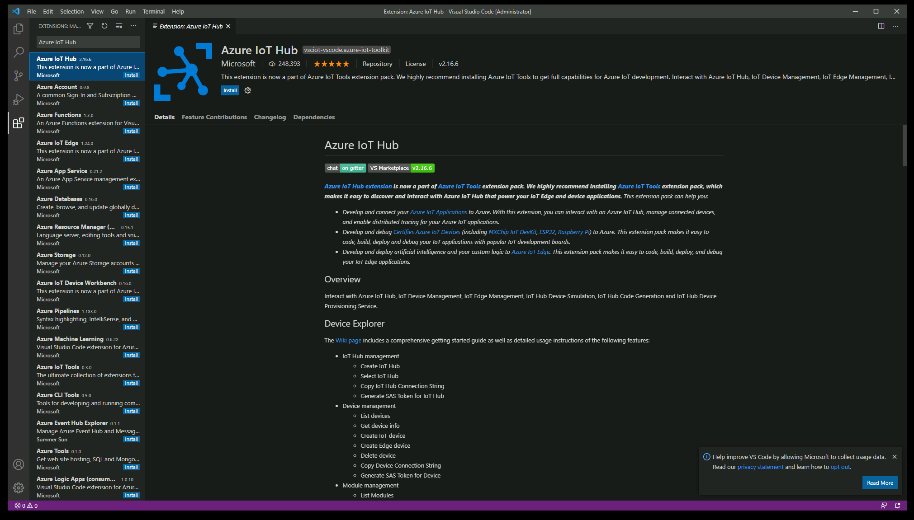</kbd>

3. **Install** Azure IoT Hub

4. In the Extensions search, select the "gear icon" to open the menu and select **Extension Settings**.

    <kbd>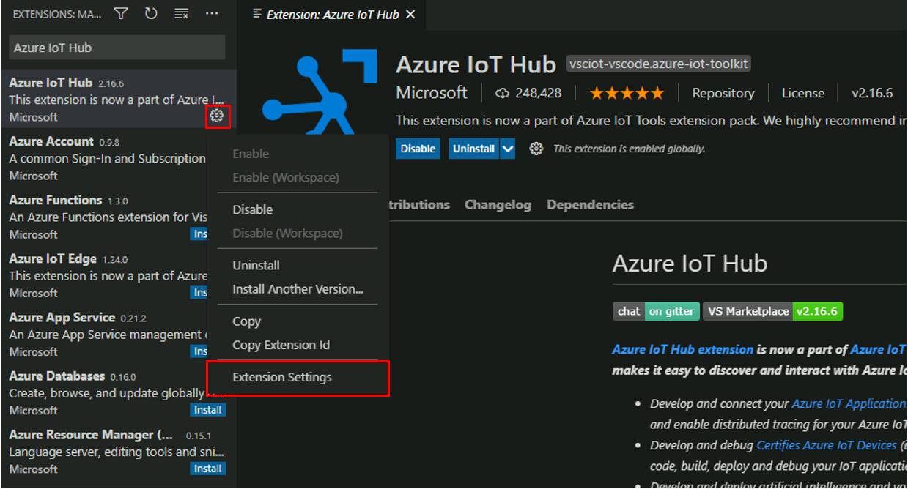</kbd>

5. Search and enable “Show Verbose Message”.

    <kbd>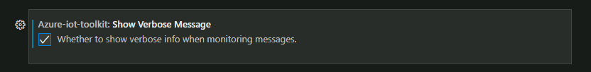</kbd>

6. Select **View** > **Explorer**. Or, select Ctrl+Shift+E.

7. In the lower-left corner of the **Explorer** tab, select **Azure IoT Hub**.

    <kbd>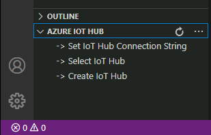</kbd>

8. Select the **More Options** icon to see the context menu. Then select **Set IoT Hub Connection String**.

9. In the Azure Portal, navigate to **IoT Hub** >> **Settings** >> **Shared access policies** >> Select the Policy for **iothubowner** and copy **Connection string-primary key**

    <kbd>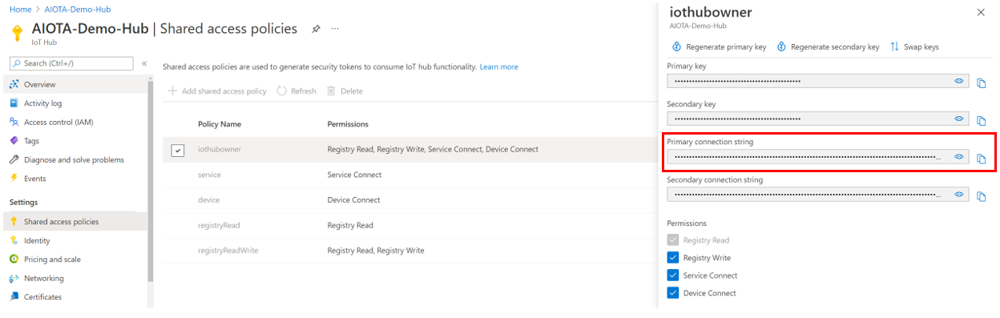</kbd>

10. Paste in visual studio code.

    <kbd>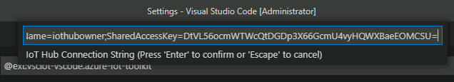</kbd>

11. Notification on the bottom right in Visual Studio should alert you that the IoT Hub Connection String has been updated.

    <kbd>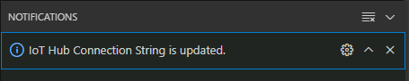</kbd>

12. At this point you should sign into your Azure account in Visual Studio if you haven't done so already by selecting the **Azure** icon on the left hand panel.

    <kbd>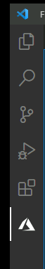</kbd>

13. Select your IoT Hub under **EndPoints**.

    <kbd>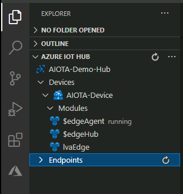</kbd>


### **Task 4: Deploy Modules on Windows Host** ###
1. Create a new folder on your Desktop called **JSON**

2. In Visual Studio navigate to **File** >> **New File**.

3. Save the file as **deployment.eflow_demo.amd64.json** in your **JSON** folder.

4. Open the **JSON folder** in Visual Studio in the explorer tab.

    <kbd>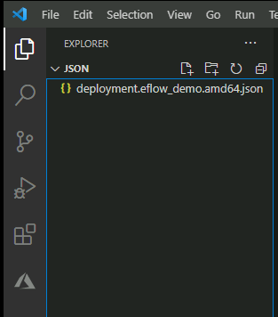</kbd>

5. In a browser window, navigate to the deployment.JSON file: https://github.com/fcabrera23/EFLOW_Demo/blob/main/deployment.eflow_demo.amd64.json

6. Select "Raw"

  <kbd>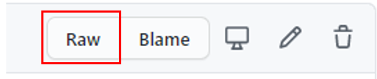</kbd>

7. **Copy** the raw input and **Paste** into new file - and **save**.

8. Right click on the file and select **Create Deployment for Single Device**

    <kbd>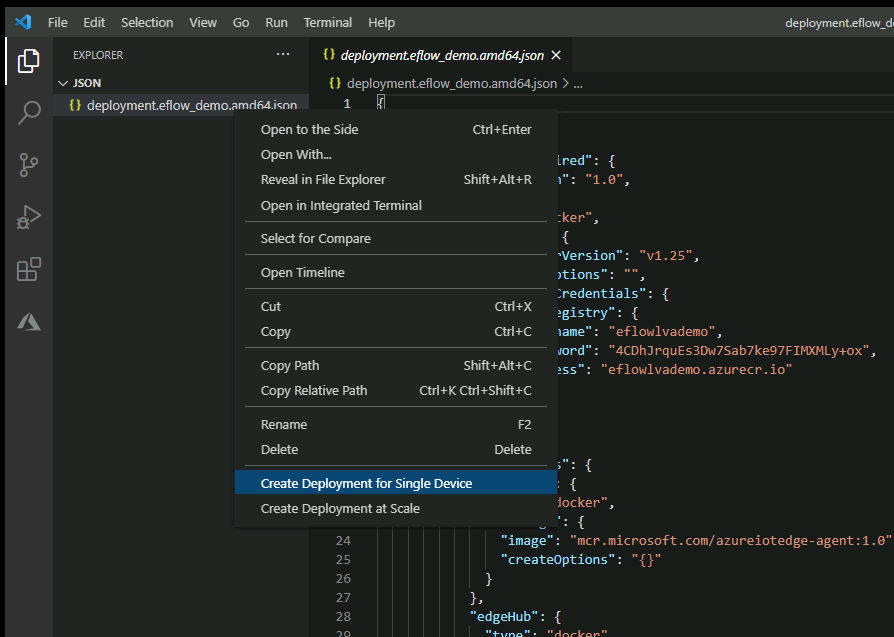</kbd>

9. Select your IoT Hub Device

    <kbd>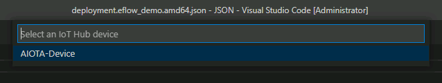</kbd>

10. You should see that your deployment has succeeded.

    <kbd>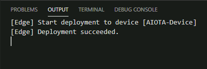</kbd>

11. Now the modules are deployed, but no media graphs are active. So we must enable graphics.

12. Open a PowerShell Window and input the following commands:

    Ssh into the EFLOW VM: `Ssh-EflowVm`

    Run: `sudo iptables -A INPUT -p udp --dport 554 -j ACCEPT`

    Run: `sudo iptables -A INPUT -p tcp --dport 554 -j ACCEPT`

    Run: `sudo iptables -A INPUT -p tcp --dport 443 -j ACCEPT`

    Run: `sudo iptables -A INPUT -p tcp --dport 5671 -j ACCEPT`

    Run: `sudo iptables-save | sudo tee /etc/systemd/scripts/ip4save > /dev/null`

    Run: `mkdir ~/certs/`

    Identify the EFLOW VM IP `sudo ifconfig`

    <kbd>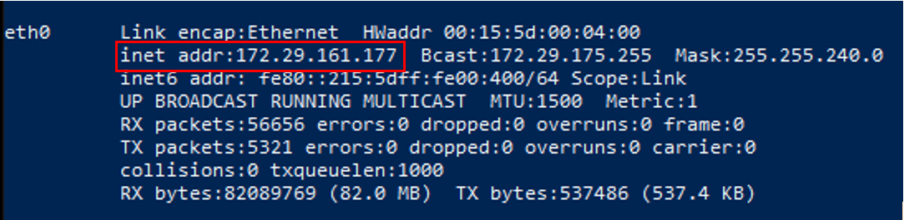</kbd>

    Run: `wget https://raw.githubusercontent.com/Azure/live-video-analytics/master/edge/setup/prep_device.sh`

    Run: `sudo sh prep_device.sh`

13. In a **NEW** PowerShell Windows (representing the **Windows host**) input the following command to get the EFLOW VM IP address.  

      ```powershell
      Get-EflowVmAddr
      ```
    <kbd>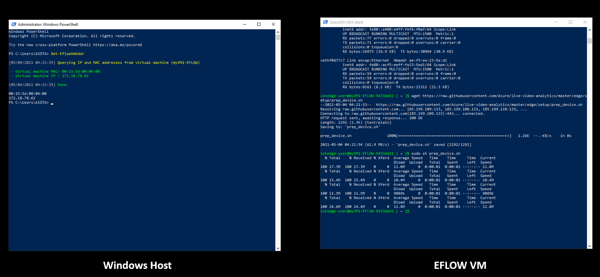</kbd>

> [!NOTE]
> This should be identical to what you found in step 12 above.

14. Next, copy certificates to the EFLOW VM environment from the Windows host. Use SCP to copy the certificates downloaded. Make sure to navigate to your Desktop. See the picture below for commands on how to do that.

    <kbd>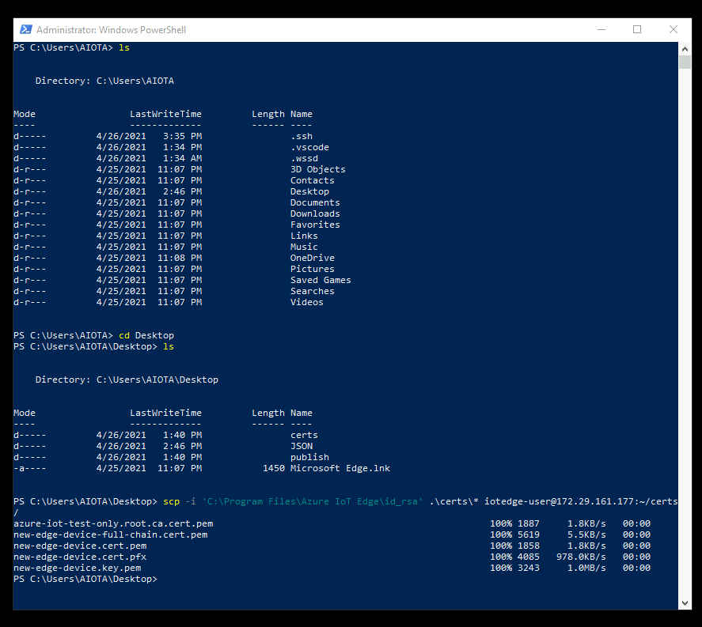</kbd>

      ```powershell
      scp -i 'C:\Program Files\Azure IoT Edge\id_rsa'  .\certs\* iotedge-user@<eflowvm-ip>:~/certs/​
      ```
> [!NOTE] Don't forget to replace **eflowvm-ip** in the command above with **your EFLOW VM's IP address** found above in **step 12 or 13**.

### **Task 5: Provision Azure IoT Edge for Linux Configuration** ###
1. Back to the EFLOW PowerShell Window, run the following command to allow Azure IoT Edge to read the certificates.
      ```bash
      sudo chown -R iotedge: ~/certs
      ```
2. Provision the Azure IoT Edge for Linux configuration
   To edit config.yaml run the following command:
    ```bash
    sudo nano /etc/iotedge/config.yaml
    ```    

3. Scroll down to **Certificates** section

    <kbd>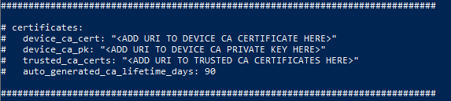</kbd>


4. **Uncomment** the following sections
    <kbd>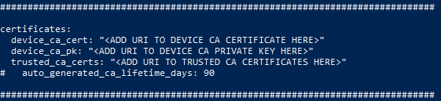</kbd>

5. Update the file paths with what's below

    ```yaml
    certificates:
        device_ca_cert: "/home/iotedge-user/certs/new-edge-device-full-chain.cert.pem"
        device_ca_pk: "/home/iotedge-user/certs/new-edge-device.key.pem"
        trusted_ca_certs: "/home/iotedge-user/certs/azure-iot-test-only.root.ca.cert.pem"
    ```

      <kbd>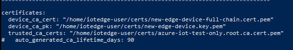</kbd>

>[!NOTE]
>
> Make sure there are **no whitespaces** before certificates paths and two spaces indenting each sub part.

6. Scroll down a little further and update the **Host IP address** with the EFLOW VM's IP address.

    <kbd>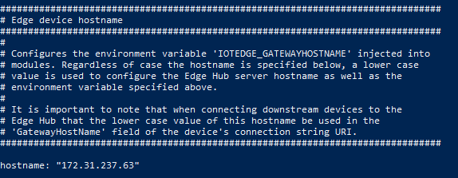</kbd>

>[!TIP]
>
> To save the file and exit nano, press <kbd>CTRL</kbd>+<kbd>x</kbd>, confirm save and exit with <kbd>Y</kbd> and press <kbd>Enter</kbd>. This concludes the provisioning and configuration.


7. Restart IoT Edge by running the following command.

    ```base
    sudo systemctl restart iotedge
    ```

### **Task 6: Test Video Stream** ###

Make sure your iotedge is running before continue, rhn the following command inside your edge machine

  ```powershell
  sudo iotedge list
  ```

Your edge status should be running before continuing:

  


1. Open VLC media player
2. Navigate to **Media** >> **Open Network Stream**
3. Input the following as the **network URL**
  ```
  rtsp://<EFLOW VM IP>:554/media/lots_015.mkv
  ```

  <kbd>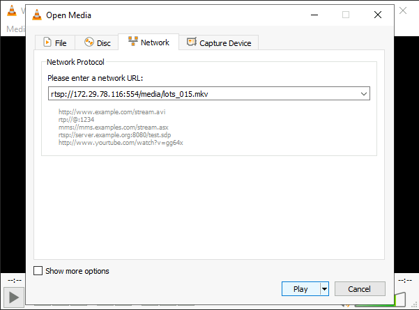</kbd>

4. Select play to view the video stream

  <kbd>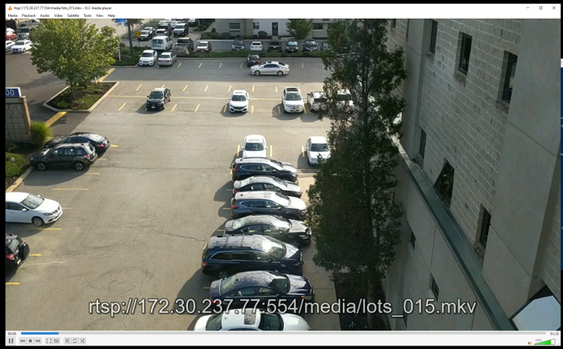</kbd>


### **Task 7: Enable Live Video Analytics: Inferencing** ###

1. In Visual Studio Code, open the **Extensions** tab (or press Ctrl+Shift+X) and search for **Live Video Analytics on IoT Edge**.

    <kbd>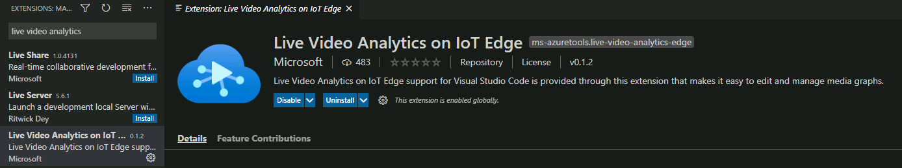</kbd>

2. **Install** Live Video Analytics on IoT Edge - once installed you will the Live Video Analytics Icon appear on the left bar
  LVA-Icon-Left

    <kbd>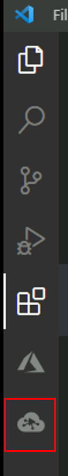</kbd>

3. Create an Azure Child Device
4. Navigate to the **Azure Portal** >> **IoT Hub** >> **IoT Devices**
5. Select **+ New** to create a new device

    <kbd>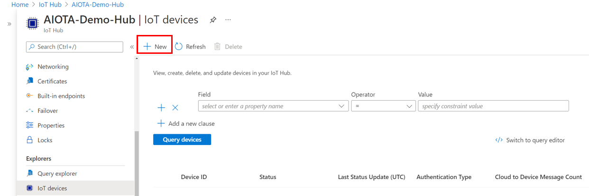</kbd>

6. Fill in the following parameters for your new device:

  | Setting | Value |
  |---------|-------|
  | Device ID | Give your device a name |
  | Authentication type | **Symmetric key** |
  | Autogenerate | Default - Keep Selected |
  | Connect this device to an IoT Hub | **Enable** |
  | IoT Hub to Use | Select your **Parent IoT Edge Device** |

    <kbd>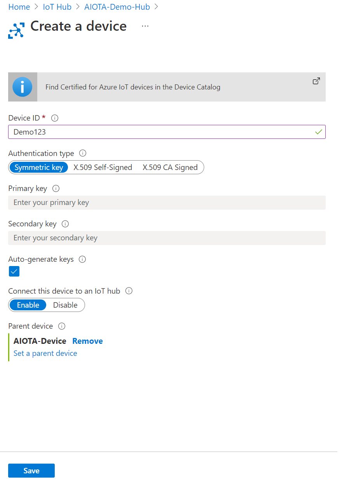</kbd>

7. Add connection string in Live Video Analytics extension in Visual Studio

    <kbd>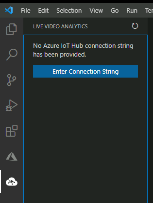</kbd>

8. **Azure Portal** >> **IoT Hub** >> **Share access policies** >> select **iothubowner** >> copy **Connection string-primary key**

    <kbd>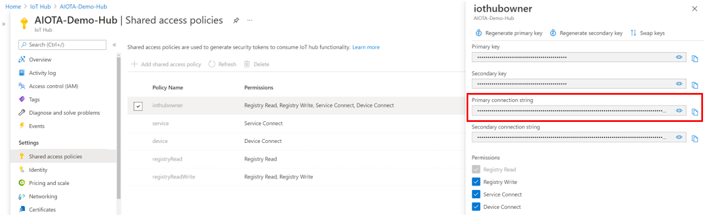</kbd>

9. Enter IoT Hub connection string into Visual Studio

    <kbd></kbd>

10. Select your IoT Edge **PARENT** Device

11. Select the Live Video Analytics module: **lvaedge**

12. You should now see this in the Live Video Analytics pane.

    <kbd>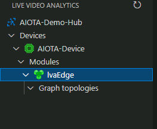</kbd>

13. Navigate to the **Azure Iot Hub** tab in Visual Studio >> **Devices** >> **Modules** >> **lvaEdge** right click and select **Invoke Module Direct Method**

    <kbd>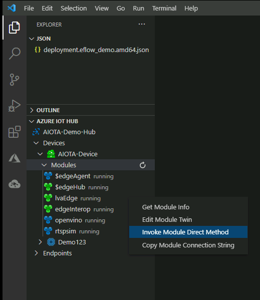</kbd>

14. Enter **[Method name]** as *GraphTopologySet*

    <kbd>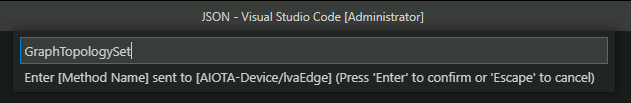</kbd>


15. In a browser window, navigate to the **lva_graph_topology_track.JSON:** https://github.com/fcabrera23/EFLOW_Demo/blob/main/lva_graph_topology_truck.json

16. Select "Raw"

    <kbd></kbd>

17. **Copy** the raw input

18. Paste the [Payload] (lva_group_topology_track) in Visual Studio (black bar on the top) and hit enter.

    <kbd>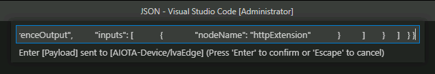</kbd>

19. Navigate to the Live Video Analytics tab and you should see **InferencingwithOpenVino** under Graph topologies

    <kbd>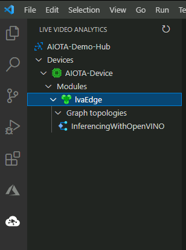</kbd>

20. Select **+** next to **InferecingwithOpenVino** to create a new graph instance

    <kbd>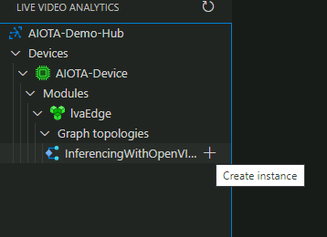</kbd>

21. Input the following parameters:

| Setting | Value |
|-|-|
| Instance name | Give your instance a name |
| rtspUrl | **rtsp://rtspsim:554/media/lots_015.mkv** |

  <kbd>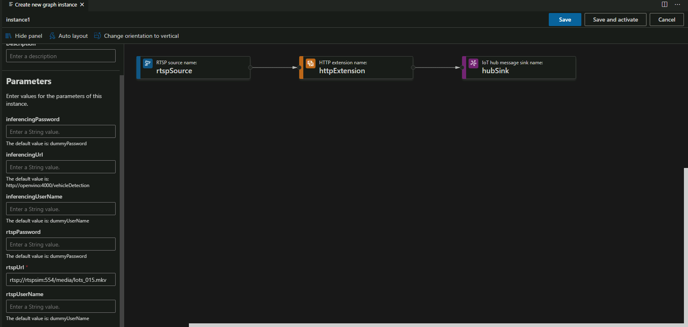</kbd>

22. Select **Save** at the top right corner.

23. Under the graph topology, InferecingwithOpenVino, you should see your new instance has been created.

    <kbd>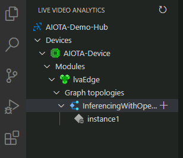</kbd>

24. Navigate back to the **Azure IoT Hub** in Visual Studio >> **Device** > **IoT Edge Device** right click and select **Start Monitoring Built-in Event Endpoint**

    <kbd>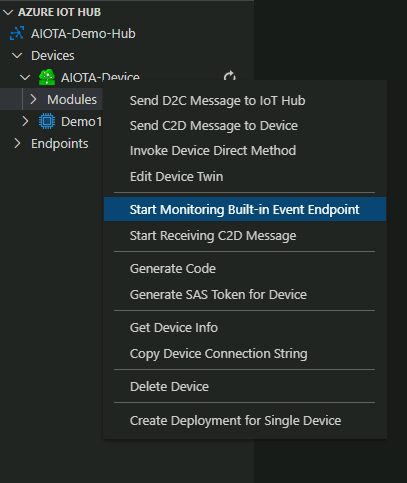</kbd>

25. Navigate back to the live video analytics tab in visual studio, and right click on your newly created instance and select **Activate Graph Instance**

    <kbd>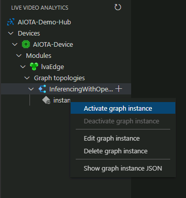</kbd>

26. You should receive a notification that you have successfully activated the instance
success-message

    <kbd>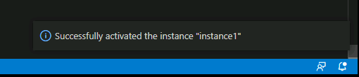</kbd>

27. In the output window you will now the inferencing occurring for each bounded box of time.

    <kbd>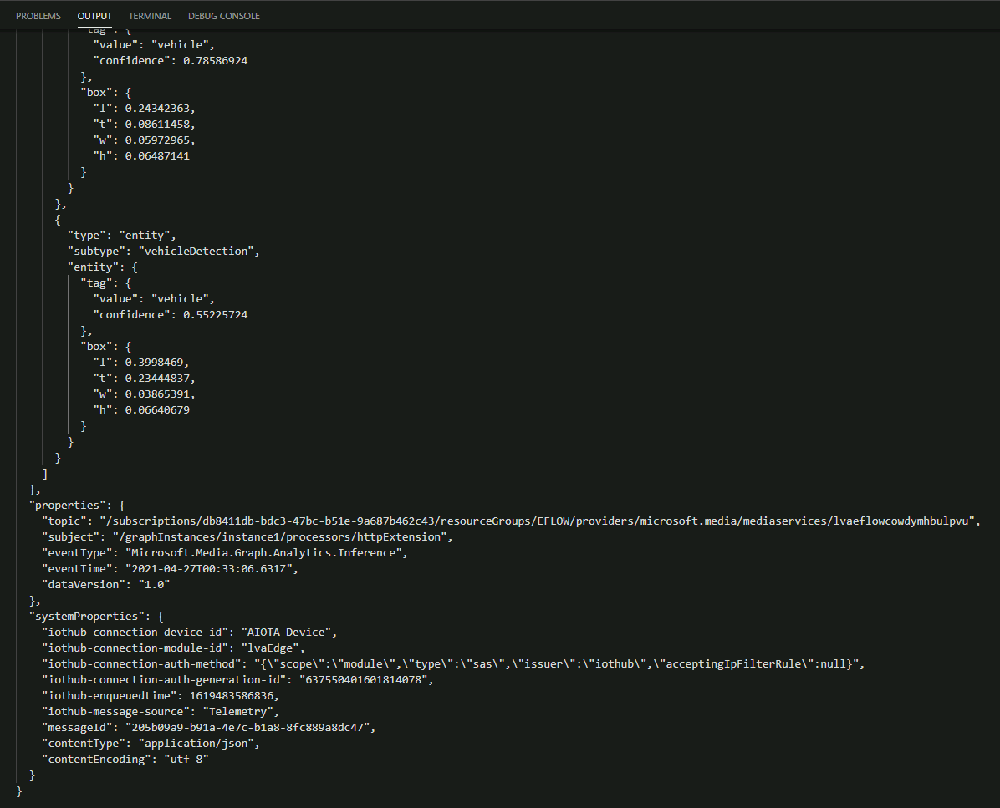</kbd>

28. Right click on the instance and select **Deactivate Graph Instance**

    <kbd>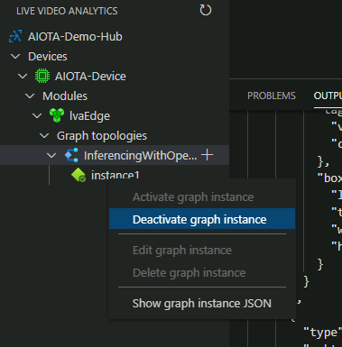</kbd>


### **Task 8: Connect Windows Video with Linux Inferencing** ###

Recap:
* We are able to see the video from windows side
* We were able to turn on/off inferencing from the Linux side

Next step: Connect the inferences with the Windows hub for a complete tool

1. Navigate to the **publish** folder > select the **EFLOW+LVA** application and run it as an administrator

    <kbd>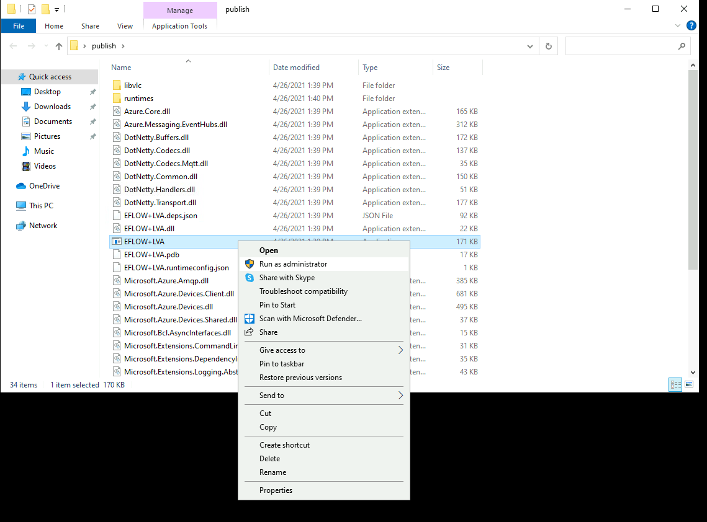</kbd>

2. Select **More info** > **Run anyway** in case Microsoft Defender SmartScreen prevents the app from running.

    **DO NOT HIT CONNECT YET**

3. Fill in the parameters:

  | Setting | Value |
  |-|-|
  | IoT Hub Device Connection String | Azure Portal >> IoT Hub >> IoT Edge >> Select **Device ID** >> Copy **Primary Connection String** |
  | EFLOW VM Hostname/IP | Insert EFLOW VM IP |
  | Certificate Path (azure-iot-test-only.root.ca.cert.pem) | [Enter the path to the certificates folder]\azure-iot-test-only.root.ca.cert.pem |
  | RTSP Connection String | rtsp://[EFLOW VM IP]/media/lots_015.mkv |

    <kbd>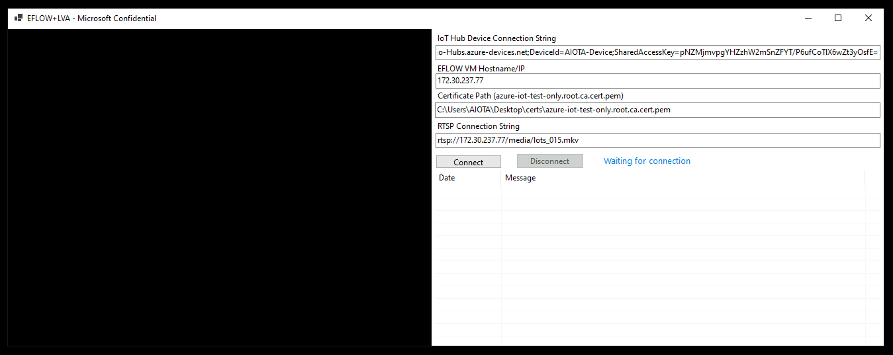</kbd>

**DO NOT HIT CONNECT YET**

4. Navigate back to the **Azure IoT Hub** in Visual Studio >> **Device** > **IoT Edge Device** right click and select **Start Monitoring Built-in Event Endpoint**

    <kbd></kbd>

5. Navigate back to the live video analytics tab in visual studio, and right click on your newly created instance and select **Activate Graph Instance**

    <kbd></kbd>

6. You should receive a notification that you have successfully activated the instance
success-message

    <kbd></kbd>

7. In the output window you will now the inferencing occurring for each bounded box of time.
output

    <kbd></kbd>

8. Return to the Windows Application and select *connect* - if the connection did not work - please see error message.

    <kbd>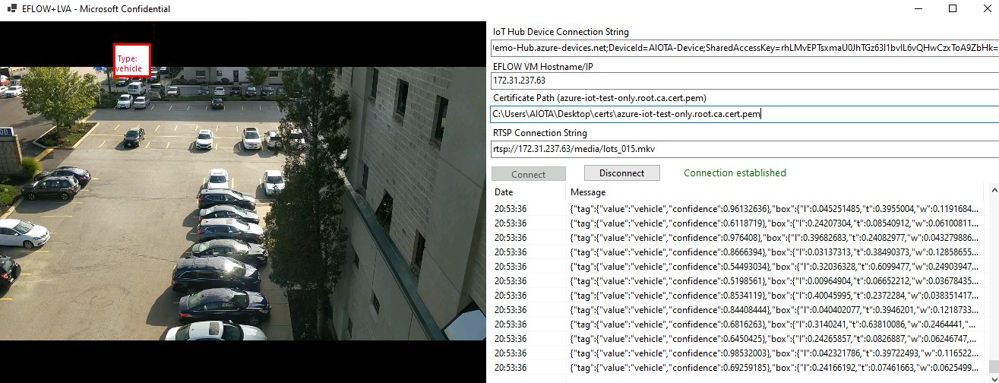</kbd>

9. When you are done, select *disconnect* on the EFLOW + LVA Application.

10. Navigate back to the live video analytics tab in visual studio, and right click on the instance and select **Deactivate Graph Instance**.

    <kbd></kbd>

## **Exercise 4: Clean Up** ##

### **Task 1: Delete resources** ###
When you're done using the virtual network and VM, delete the resource group and all of the resources it contains:

1. Search for and select **myResourceGroup**.

1. Select **Delete resource group**.

1. Enter **myResourceGroup** for **TYPE THE RESOURCE GROUP NAME** and select **Delete**.
